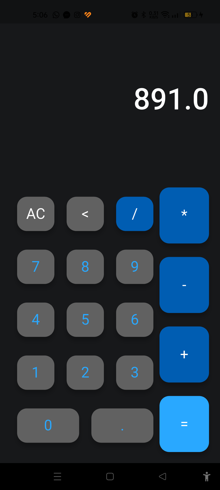

## About the Project
The Calculator App is a cross-platform Flutter application built with Dart, offering a clean, modern interface for both basic and complex mathematical calculations. It is optimized for high performance on both Android and iOS devices.

## Features

- **Basic Arithmetic Operations** – Addition, subtraction, multiplication, and division
- **Intuitive User Interface** – Clean and responsive design optimized for all screen sizes
- **Cross-Platform Support** – Runs seamlessly on both Android and iOS devices
- **Fast Performance** – Optimized code for quick calculation results

## Technologies Used

- **Flutter** – Cross-platform mobile framework
- **Dart** – Programming language for Flutter development
- **Material Design** – Google's design system for consistent UI/UX

## Screenshots

  

  

